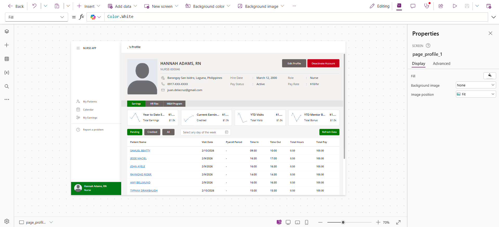
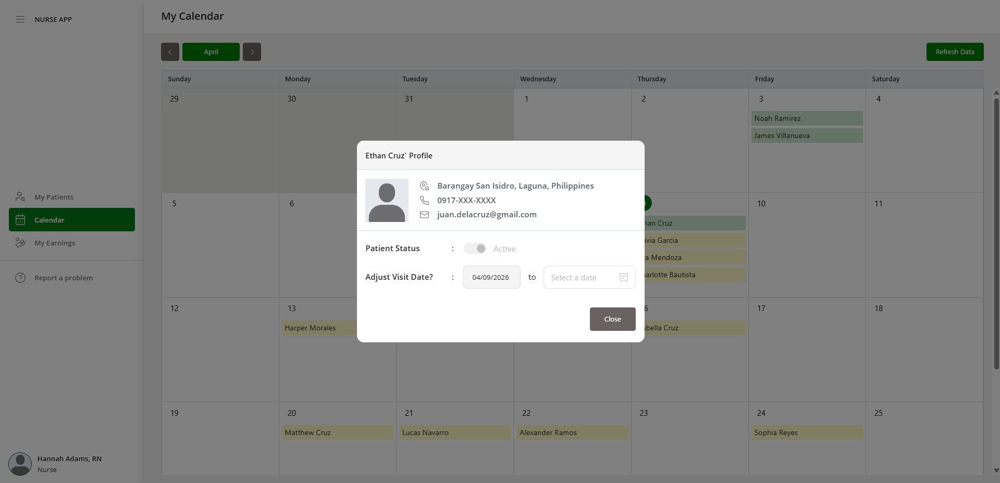
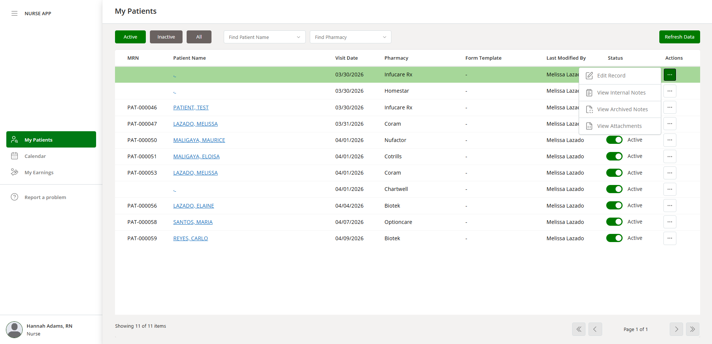
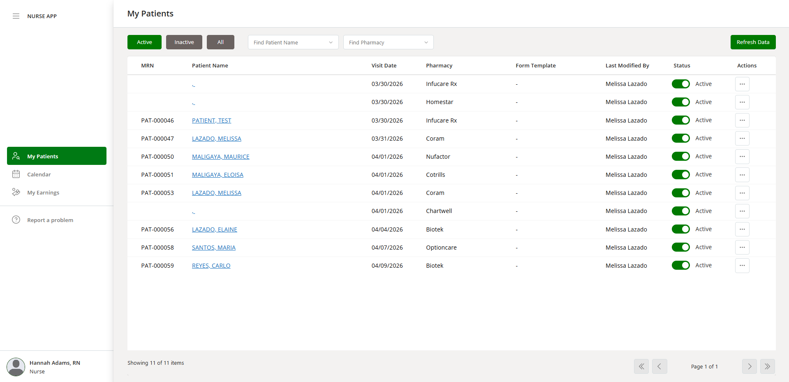
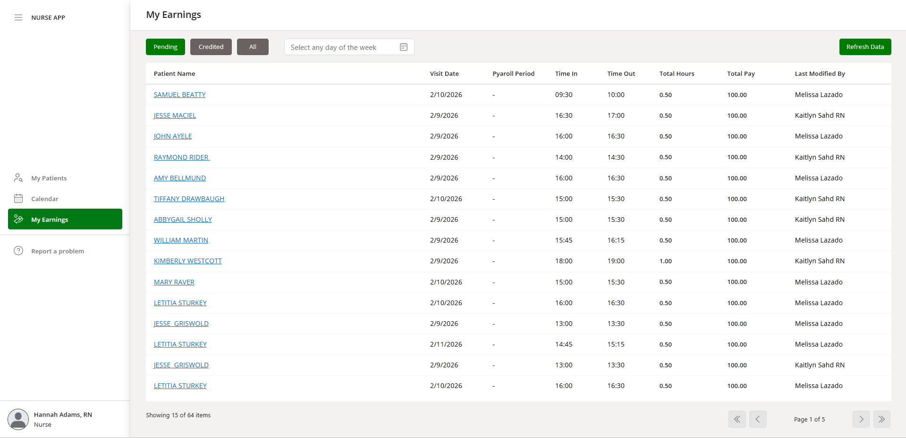
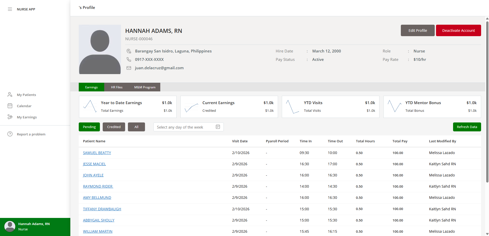

# 📱 Nurse App (PowerApps)

---

## 📌 Project Overview
A PowerApps-based system designed for managing nurse profiles, earnings, and patient-related records. Built with a focus on performance, scalability, and clean UI/UX, while handling real-world limitations like delegation and large datasets.

---

## 🖼️ UI Preview

---

## ⚙️ What’s Under the Hood
This project goes beyond basic PowerApps by applying structured logic and performance optimizations:

- **Data Handling Strategy:**
  - Delegation-aware queries
  - Pagination logic to bypass record limits
- **Role-Based Logic:**
  - Conditional rendering based on user roles
  - Secured actions (edit, deactivate)
- **Custom UX Enhancements:**
  - Non-native modals
  - Dynamic notifications (instead of default alerts)

---

## ✨ Features
- 🔐 Role-based access control  
- ⚠️ Custom warning notifications  
- ✅ User input validation  
- 🪟 Custom modals  
- 📄 Pagination (delegation workaround)  
- 🎨 Minimalist design  
- ⚡ Optimized solution  

---

## 🛠️ Tech Stack
- **PowerApps (Canvas App)**
- **Power Fx**
- **Data Source:** SharePoint (Lists & Libraries)  
- **Power Automate**

---

## ⚠️ Challenges
- Delegation limits (500–2000 records)  
- Managing complex conditional UI logic  
- Performance issues with large datasets  
- Maintaining clean UX without relying on native components  
- Positioning custom “more options” modals dynamically (attaching them to the correct UI element)

---

## 💡 Solutions Implemented
- Built **custom pagination system**
- Used **delegation-friendly functions** (`Filter`)
- Created **modular components** for reusability
- Structured logic to reduce re-renders and heavy computations
-  To correctly attach a custom “more options” modal to a specific item:
  - Sort paginated items (ascending or descending)  
  - Use `CountRows()` to determine how many records are before/after the selected item (based on sort order)  
  - Store the result in a **context variable** to keep scope local and avoid global clutter  

  **Positioning Logic:**
  - Compute: `Self.Y + Self.Height`  
  - Compare with: `Parent.Height`  
    - If greater → place modal **above**  
    - Else → place modal **below**  
  
  This ensures the modal stays visible and properly aligned regardless of its position in the list.

---

## 📷 Additional Screens

